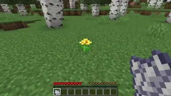

# Maddie's Building Tweaks
This is a building mod made with the philosophy that nothing that you build should be destroyed if it is removed.

 

## Features
### Multi Flowers (Versions >= 1.0.0)
Allows you to place up to four of the same type of flower(Including Modded Flowers) in a single block for decoration and
adds the ability to place flowers in a rotated. Makes flowers more renewable by allowing you to bonemeal them.

Works With Flowers Added By Mods.

### Flower Pots (Versions >= 0.1.0)

Makes it possible to place up to five of one type of flower in a pot.

 
Old Versions

### Multi-flowers Pre-1.0.0
Allows you to place up to four of the same type of flower(Including Modded Flowers) in a single block for decoration and makes flowers more renewable by allowing you to bonemeal them.

### More Coming Soon
## License

Copyright (C) 2022-2023  Madeline Whitmore

This program is free software: you can redistribute it and/or modify
it under the terms of the GNU General Public License as published by
the Free Software Foundation, either version 3 of the License, or
any later version.

This program is distributed in the hope that it will be useful,
but WITHOUT ANY WARRANTY; without even the implied warranty of
MERCHANTABILITY or FITNESS FOR A PARTICULAR PURPOSE.  See the
GNU General Public License for more details.

You should have received a copy of the GNU General Public License
along with this program.  If not, see <https://www.gnu.org/licenses/>.
